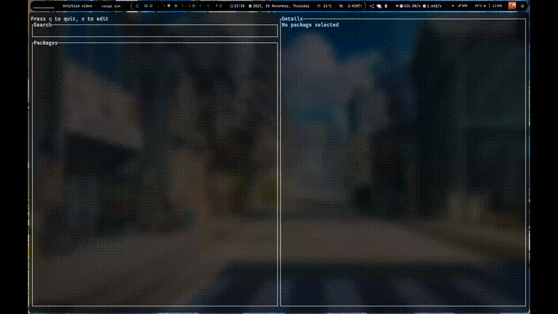

<div align="center">


<br/>
<br/>

**A fast, keyboard-driven TUI package manager written in Rust.**

Search 50,000+ packages in under 50ms. Install, remove, and update without leaving your terminal.

<br/>


</div>

---

<div align="center">



</div>

---

## What is TRX?

TRX is a terminal UI built on top of your existing package manager. It gives you a unified, keyboard-first interface for searching, inspecting, and managing packages, whether you're on macOS with Homebrew, Arch with Pacman + AUR, or Debian/Ubuntu with APT.

No daemon. No config file. Just run `trx`.

---

## Features

- **Fuzzy search**: 50ms debounced live search with scoring-based ranking
- **Multi-manager**: Homebrew, Pacman, AUR (via yay), and APT, auto-detected at launch
- **Batch operations**: select multiple packages with `space`, install or remove in one shot
- **Side-by-side detail panel**: version, size, dependencies shown instantly as you navigate
- **Zero overhead**: pure Rust, OS threads + `mpsc` channels, no async runtime
- **Three tabs**: Search, Installed, Updates all in one interface

---

## Installation

### From source

```bash
git clone https://github.com/pie-314/trx.git
cd trx
cargo build --release
sudo cp target/release/trx /usr/local/bin/
```

**Requirements:** Rust 1.70+ · Unicode/truecolor terminal

### Cargo

```bash
cargo install trx
```

---

## Usage

```bash
trx
```

### Keybindings

| Key | Action |
|-----|--------|
| `e` | Enter search mode |
| `↑` / `↓` or `j` / `k` | Navigate list |
| `space` | Toggle package selection |
| `i` | Install selected |
| `x` | Remove selected |
| `U` | System upgrade |
| `R` | Refresh databases |
| `Tab` | Switch tab (Search → Installed → Updates) |
| `q` / `Esc` | Quit / exit current mode |

---

## Architecture

```
src/
├── main.rs              # Entry point, terminal setup
├── ui/
│   ├── app.rs           # App state, event loop, channel polling
│   └── input.rs         # Input mode, debounce logic
├── managers/
│   ├── mod.rs           # PackageManager trait, shared parsing
│   ├── arch.rs          # Pacman + AUR (yay) backend
│   ├── apt.rs           # APT backend
│   └── brew.rs          # Homebrew backend
└── fuzzy/
    └── mod.rs           # Scoring engine
```

### PackageManager trait

```rust
pub trait PackageManager {
    fn search(&self, query: &str) -> Result<Vec<Package>, ManagerError>;
    fn install(&self, terminal: &mut DefaultTerminal, pkgs: &[String]) -> Result<(), ManagerError>;
    fn remove(&self, terminal: &mut DefaultTerminal, pkgs: &[String]) -> Result<(), ManagerError>;
    fn get_installed(&self) -> Result<Vec<Package>, ManagerError>;
    fn get_updates(&self) -> Result<Vec<Package>, ManagerError>;
    fn get_details(&self, name: &str, provider: &str) -> Result<DetailsState, ManagerError>;
    fn system_upgrade(&self, terminal: &mut DefaultTerminal) -> Result<(), ManagerError>;
    fn refresh_databases(&self) -> Result<(), ManagerError>;
}
```

### Concurrency model

Search, list loads, and detail fetches all run on **OS threads** communicating via `std::sync::mpsc`. The main loop polls keyboard input with a short timeout, redraws each frame, and non-blockingly drains result channels.

---

## Supported Package Managers

| Manager | Platform | Status |
|---------|----------|--------|
| Pacman | Arch Linux | Implemented |
| yay (AUR) | Arch Linux | Implemented |
| APT | Debian / Ubuntu | Implemented |
| Homebrew | macOS | Implemented |
| dnf / yum | Fedora / RHEL | Planned |
| zypper | openSUSE | Planned |
| winget / scoop | Windows | Planned |

---

## Roadmap

- [ ] Configurable keybindings via config file
- [ ] Pluggable themes and renderer settings
- [ ] Transaction history and rollback
- [ ] Batch mode for scripting / CI use
- [ ] Dependency graph visualizer
- [ ] Metadata caching for faster repeated searches
- [ ] Plugin system for custom backends and widgets
- [ ] Binary releases via GitHub Actions

---

## Contributing

Contributions are welcome. If you're interested in Rust, terminal UIs, or package manager internals, pick an open issue or start a discussion.

See [CONTRIBUTING.md](CONTRIBUTING.md) for guidelines.

---

## License

MIT. See [LICENSE](LICENSE) for details.
