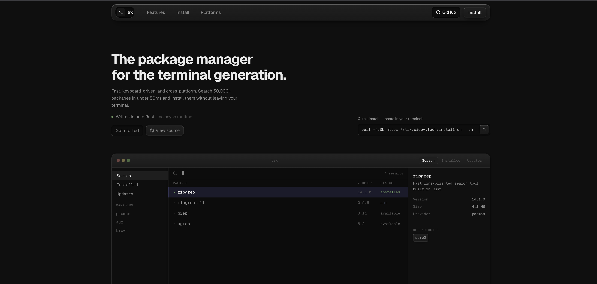

<div align="center">


<br/>
<br/>

**Landing page for TRX, the terminal package manager.**

Built with Next.js 16 · React 19 · Tailwind CSS 4 · TypeScript

<br/>
<br/>


</div>

---

## Preview

<div align="center">



</div>

**On the page:** tagline *“The package manager for the terminal generation.”*, value props (fast keyboard-driven cross-platform search, 50k+ packages, pure Rust), quick install via curl, and a three-panel terminal-style demo (search / installed / updates, managers such as pacman, AUR, brew).

**Quick install** (same as the site):

```bash
curl -fsSL https://trx.pidev.tech/install.sh | sh
```

**To embed a video** in this README later, add something like:

```html
<video src="../assets/web-demo.mp4" controls width="720" />
```

---

## About

`trx-web` is the marketing and landing site that lives alongside the [`trx`](../README.md) CLI in this monorepo. It is a fully static Next.js site with no runtime connection to the Rust binary.

**What the site covers:**

- Hero with headline, CTAs (Get started, View source), and status line (“Written in pure Rust — no async runtime.”)
- Quick install strip with copy-to-clipboard for the install script URL
- Animated live-demo terminal mockup (3-panel TUI: package list, detail pane, managers)
- Feature overview: fuzzy search, multi-manager, batch operations, zero overhead
- Step-by-step install guide with keyboard shortcut reference
- Platform support badges: macOS, Arch Linux, Debian/Ubuntu

**Not implemented yet:**

- Web UI that talks to a running `trx` process
- Docs site, changelog, or release notes page

---

## Stack

| Layer | Choice |
|-------|--------|
| Framework | Next.js 16 (App Router) |
| UI | React 19 |
| Styling | Tailwind CSS 4 + inline styles |
| Language | TypeScript |
| Package manager | Bun |

> See [AGENTS.md](./AGENTS.md) for important Next.js 16 API caveats before editing.

---

## Getting Started

```bash
# from the trx-web/ directory
bun install
bun dev
```

Open [http://localhost:3000](http://localhost:3000).

---

## Project Structure

```
trx-web/
├── src/
│   └── app/
│       ├── page.tsx      # full landing page (single file)
│       ├── layout.tsx    # root layout + metadata
│       ├── globals.css   # Tailwind import
│       └── icon.svg      # favicon (auto-detected by Next.js)
├── public/               # static assets served at /
└── package.json
```

---

## Assets

Shared project assets (logo, screenshots, demo gif) live in [`../assets/`](../assets/) at the monorepo root:

| File | Description |
|------|-------------|
| `assets/logo.svg` | TRX logo (icon + wordmark, light on transparent) |
| `assets/web-preview.png` | Landing page screenshot (hero + install + mockup) |
| `assets/trx-preview.gif` | Terminal demo recording |

---

## Links

- [TRX root README](../README.md)
- [Next.js docs](https://nextjs.org/docs)
